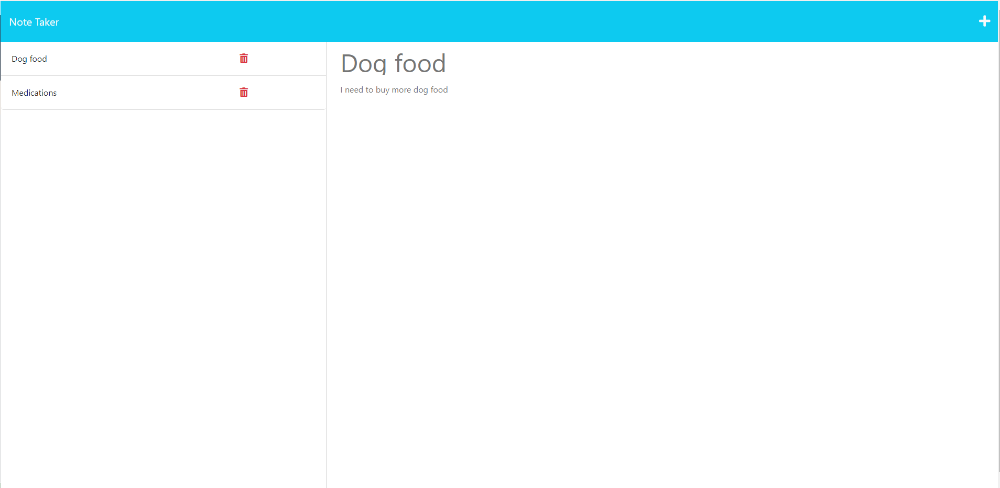

# Note Taker

# Description
    - This Note Taker application can take user input for a written note and save the note to a JSON file.
    - The application uses Express.js for the backend.
    - The application's front end was provided and the task was to build the backend and then connect the front and back end.
    - The finished application was deployed to Heroku
    
    
# Installation

   Follow the following link to the project URL: https://cac-note-taker-2587b56ecea8.herokuapp.com/

    
# Usage

   
    - On the left is previously typed notes. If you click on one of the previously typed notes it appears on the right.
    - The user can add a note on the right and it will save to the left.
    -If the user clicks on the delete button the note will be deleted.

# Credits
    Donnie Rawlings: https://github.com/drawlin22/
    Kyle Jocoy: https://github.com/Kylyote/
    AskBCS Royce Ojwilli for bug fixes
    Tutor Neil Dhand for help with finalizing the saving of notes and the deleting.
   
   
# License
    MIT

